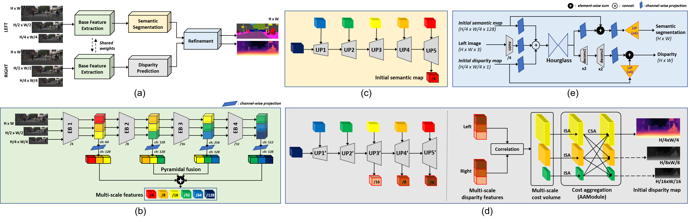

## RODSNet: End-to-end Real-time Obstacle Detection Network for Safe Self-driving via Multi-task Learning

This is the official PyTorch source code for the proposed end-to-end framework for **R**eal-time **O**bstacle **D**etection Network via **S**imultaneous semantic segmentation and disparity estimation (RODSNet). Below shows the overall network architecture.
<p align="center"></p>

*Figure: (a) Overview of the proposed multi-task learning architecture for real-time class-agnostic obstacle detection. The main pipeline includes: (b) base feature extractor: shared encoder blocks between left and right images and multi-scale features obtained by pyramidal fusion; (c) semantic segmentation module: successively upsampled multi-scale features to produce initial semantic map estimates of 1/4 resolutions of the original; (d) disparity prediction module: multi-scale disparity features of 1/16, 1/8, 1/4 resolutions are upsampled by the disparity feature extractor (left) and used to compute 3D cost volumes, aggregate costs and produce initial disparity map estimates (right). Grayscale maps (1/8, 1/16) are used only for training (rightmost); (e) refinement module: simultaneous refinement of initial semantic segmentation and disparity estimates (both 1/4 resolution) along with the reference RGB image to yield final maps for both tasks.*

---
#### Evaluation Demo (real-world)


---
### Environment Setup
- PyTorch v1.2.0
- CUDA 10.0
- Python 3.7 (recommended: [Anaconda](https://www.anaconda.com/distribution/))

```shell
conda env create -f environment.yaml   // set up a virtual environment
conda activate rodsnet                 // activate the environment
cd network/deform_conv && bash build.sh // build deformable convolution
```

---

### Datasets
- [Scene Flow](https://lmb.informatik.uni-freiburg.de/resources/datasets/SceneFlowDatasets.en.html), 
- [KITTI Stereo 2012](http://www.cvlibs.net/datasets/kitti/eval_stereo_flow.php?benchmark=stereo), 
- [KITTI Stereo 2015](http://www.cvlibs.net/datasets/kitti/eval_scene_flow.php?benchmark=stereo), 
- [Cityscapes](https://www.cityscapes-dataset.com/)
- [Lost and Found](http://www.6d-vision.com/lostandfounddataset) 

To detect objects of both class-agnostic obstacle class (from Lost and Found) and the set of 19 annotated classes (from Cityscapes), we created a `city_lost` directory by our multi-dataset fusion approach. Our folder structure is as follows:

<details>
<summary> Click to see the directory structure </summary>

```
datasets
└── sceneflow
│   ├── Driving
│   │   ├── disparity
│   │   └── frames_finalpass
│   ├── FlyingThings3D
│   │   ├── disparity
│   │   └── frames_finalpass
│   └── Monkaa
│       ├── disparity
│       └── frames_finalpass
├── kitti_2012
│   ├── training
│   │   ├── colored_0
│   │   ├── colored_1
│   │   └── disp_occ
│   └── testing
│       ├── colored_0
│       └── colored_1
├── kitti_2015
│   ├── training
│   │   ├── image_2
│   │   ├── image_3
│   │   ├── disp_occ_0
│   │   └── semantic
│   └── testing
│       ├── image_2
│       └── image_3
└── cityscapes
|   ├── leftImg8bit
|   ├── rightImg8bit
|   ├── disparity
|   └── gtFine
|       ├── train
|       ├── val
|       └── test
└── city_lost
    ├── leftImg8bit
    |   ├── train
    |   |   ├── 01_Hanns_Klemm_Str_45
    |   |   ├── 03_Hanns_Klemm_Str_19
    |   |   ├── ...
    |   |   └── zurich
    |   └── val
    |       ├── 02_Hanns_Klemm_Str_44
    |       ├── 04_Maurener_Weg_8
    |       ├── ...
    |       └── munster
    ├── rightImg8bit
    |   ├── same structure with leftImg8bit
    ├── disparity
    |   ├── same structure with leftImg8bit
    └── gtFine
    |   ├── train
    |   |   ├── aachen
    |   |   ├── bochum
    |   |   ├── ...
    |   |   └── zurich
    |   └── val
    |       ├── frankfurt
    |       ├── lindau
    |       └── munster
    └── gtCoarse
        ├── train
        |   ├── 01_Hanns_Klemm_Str_45
        |   ├── 03_Hanns_Klemm_Str_19
        |   ├── ...
        |   └── 14_Otto_Lilienthal_Str_24
        └── val
            ├── 02_Hanns_Klemm_Str_44
            ├── 04_Maurener_Weg_8
            ├── ...
            └── 15_Rechbergstr_Deckenpfronn
```
</details>

---

### Pre-trained weights
Download all pretrained models [here](https://drive.google.com/file/d/1U5fl2V5Y7HuUiEIiVFSm5CxFLSC-Xx6n/view?usp=sharing) and place them under the `$RODSNet/ckpt`.

---

#### Train and Evaluate
Detailed commands for training and evaluation are described in `script/train_test_guide.txt`. 

For training our RODSNet on `city_lost` datasets:
```shell
python main.py --gpu_id 0 --dataset city_lost --checkname resnet18_train_citylost_eps_1e-1_without_transfer \
--optimizer_policy ADAM --lr 4e-4 --weight_decay 1e-4 --epochs 400 \
--train_semantic --train_disparity --with_refine --refinement_type ours --batch_size 4 --val_batch_size 4 \
--epsilon 1e-1
```
Trained results are saved in `$RODSNet/run/[dataset]/[checkname]/experiment_0/` directory.

To evaluate our performance on `city_lost` dataset with pretrained results:

RODSNet-1x :
```shell
python main.py --gpu_id 0 --dataset city_lost --checkname city_lost_test_RODSNet_1x \
--with_refine  --refinement_type ours --val_batch_size 1 --train_semantic --train_disparity --epsilon 1e-1 \
--resume ckpt/city_lost/RODSNet_1x/score_best_checkpoint.pth --test_only
```

RODSNet-2x :
```shell
python main.py --gpu_id 0 --dataset city_lost --checkname city_lost_test_RODSNet_2x \
--with_refine  --refinement_type new18 --val_batch_size 1 --train_semantic --train_disparity --epsilon 1e-1 \
--resume ckpt/city_lost/RODSNet_2x/score_best_checkpoint.pth --test_only
```


For fast inference, evaluation is run without saving the intermediate results.  (To save any results, add `--save_val_results` option. The output results will then be saved in `$RODSNet/run/[dataset]/[checkname]/experiment_0/results` folder.)

#### Sample Inference Test

```shell
python sample_test.py --gpu_id 0 \
--with_refine \
--refinement_type ours \
--train_disparity --train_semantic \
--resume ckpt/city_lost/best_model_city_lost/score_best_checkpoint.pth
```

---

### Acknowledgments

- This  work  was  supported  by  the Institute  for  Information  &  Communications  Technology  Promotion  (IITP)grant funded by the Korea government (MSIT) (No.2020-0-00440, Development of Artificial Intelligence Technology that Continuously Improves Itself as the Situation Changes in the Real World).

- Parts of the code are adopted from previous works ([AANet](https://github.com/haofeixu/aanet), and [RFNet](https://github.com/AHupuJR/RFNet)). We appreciate the original authors for their awesome repos. 

### Citation
```bash
@article {songjeong2021rodsnet,
    author = {Song, Taek-jin and Jeong, Jongoh and Kim, Jong-Hwan},
    title = {End-to-end Real-time Obstacle Detection Network for Safe Self-driving via Multi-task Learning},
    year = {2021},
    doi = {???},
    URL = {https://doi.org/???},
    journal = {Journal}
}
```
