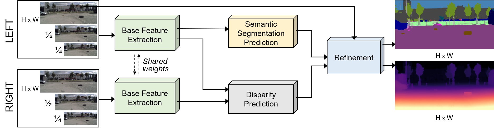
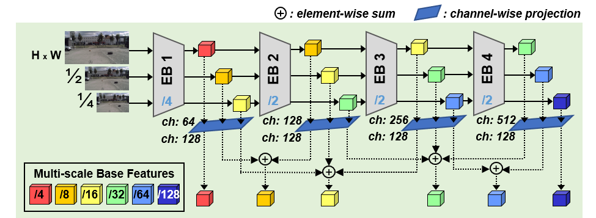
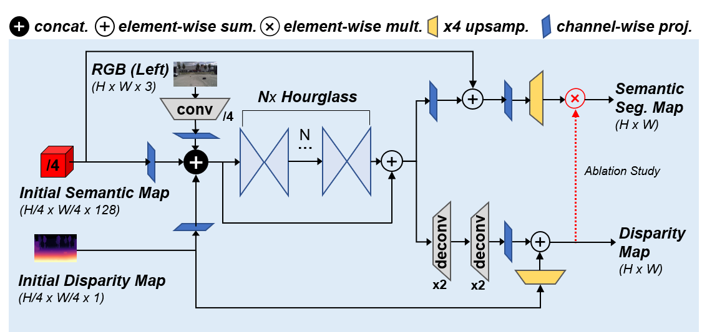
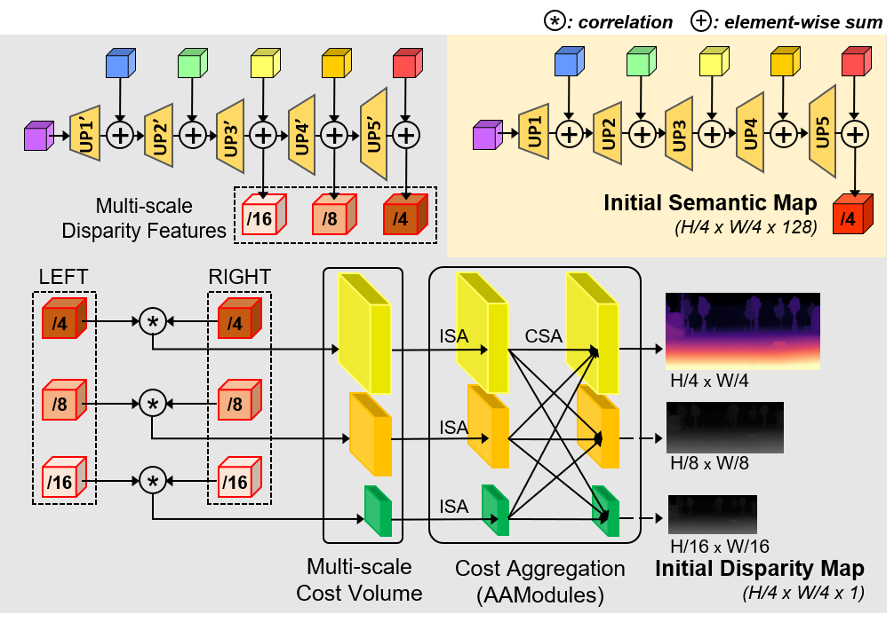

## RODSNet: End-to-end Real-time Obstacle Detection Network for Safe Self-driving via Multi-task Learning

This is the official PyTorch source code for the proposed end-to-end framework for **R**eal-time **O**bstacle **D**etection via **S**imultaneous refinement **N**etwork (RODSNet). Below shows the overall network architecture.
<p align="center"></p>

*Figure: Overview of the proposed end-to-end network architecture for class-agnostic obstacle detection. The network takes a
pair of stereo RGB images to infer semantic segmentation and disparity map simultaneously, from which it detects unexpected
small obstacles (in brown).*


Base Feature Extraction & Refinement Module                      |  Initial Estimation of Semantic segmentation and Disparity prediction
:-------------------------------------------:|:----------------------------------------------------------------------:
  |  


*Base feature extraction (in green background): Intermediate features of the same scale are each summed to yield multi-scale base features
of scales 1/4 , 1/8 , 1/16 , 1/32 , 1/64 , 1/128 . The network parameters are shared for both left and right RGB images. EB denotes an encoder backbone block.*

*Semantic segmentation (in yellow background): multi-scale features are successively upsampled to produce an initial semantic map estimate of 1/4 resolution of the original.*

*Disparity prediction (in gray background): we correlate the multi-scale disparity features of scales 1/4, 1/8, 1/16 and compute a multi-scale 3D cost volume, aggregate costs, and produce an initial disparity map estimate in three different resolutions. Grayscale maps are used only for training.*
 
*Refinement (in blue background): initial semantic and disparity maps, and the left RGB (reference) image are fed into Nx hourglass network, and then upsampled with skip connections. The effect of the red branch is studied in ablation.*

---
#### Evaluation Demo (real world), (RODSNet-2x vs. RFNet)


---
### Environment Setup
- PyTorch v1.2.0
- CUDA 10.0
- Python 3.7 (recommended: [Anaconda](https://www.anaconda.com/distribution/))

```shell
conda env create -f environment.yaml   // set up a virtual environment
conda activate rodsnet                 // activate the environment
cd network/deform_conv && bash build.sh // build deformable convolution
```

---

### Datasets
- [Scene Flow](https://lmb.informatik.uni-freiburg.de/resources/datasets/SceneFlowDatasets.en.html), 
- [KITTI Stereo 2012](http://www.cvlibs.net/datasets/kitti/eval_stereo_flow.php?benchmark=stereo), 
- [KITTI Stereo 2015](http://www.cvlibs.net/datasets/kitti/eval_scene_flow.php?benchmark=stereo), 
- [Cityscapes](https://www.cityscapes-dataset.com/)
- [Lost and Found](http://www.6d-vision.com/lostandfounddataset) 

To detect objects of both class-agnostic obstacle class (from Lost and Found) and the set of 19 annotated classes (from Cityscapes), we created a `city_lost` directory by our multi-dataset fusion approach. Our folder structure is as follows:

<details>
<summary> Click to see the directory structure </summary>

```
datasets
└── sceneflow
│   ├── Driving
│   │   ├── disparity
│   │   └── frames_finalpass
│   ├── FlyingThings3D
│   │   ├── disparity
│   │   └── frames_finalpass
│   └── Monkaa
│       ├── disparity
│       └── frames_finalpass
├── kitti_2012
│   ├── training
│   │   ├── colored_0
│   │   ├── colored_1
│   │   └── disp_occ
│   └── testing
│       ├── colored_0
│       └── colored_1
├── kitti_2015
│   ├── training
│   │   ├── image_2
│   │   ├── image_3
│   │   ├── disp_occ_0
│   │   └── semantic
│   └── testing
│       ├── image_2
│       └── image_3
└── cityscapes
|   ├── leftImg8bit
|   ├── rightImg8bit
|   ├── disparity
|   └── gtFine
|       ├── train
|       ├── val
|       └── test
└── city_lost
    ├── leftImg8bit
    |   ├── train
    |   |   ├── 01_Hanns_Klemm_Str_45
    |   |   ├── 03_Hanns_Klemm_Str_19
    |   |   ├── ...
    |   |   └── zurich
    |   └── val
    |       ├── 02_Hanns_Klemm_Str_44
    |       ├── 04_Maurener_Weg_8
    |       ├── ...
    |       └── munster
    ├── rightImg8bit
    |   ├── same structure with leftImg8bit
    ├── disparity
    |   ├── same structure with leftImg8bit
    └── gtFine
    |   ├── train
    |   |   ├── aachen
    |   |   ├── bochum
    |   |   ├── ...
    |   |   └── zurich
    |   └── val
    |       ├── frankfurt
    |       ├── lindau
    |       └── munster
    └── gtCoarse
        ├── train
        |   ├── 01_Hanns_Klemm_Str_45
        |   ├── 03_Hanns_Klemm_Str_19
        |   ├── ...
        |   └── 14_Otto_Lilienthal_Str_24
        └── val
            ├── 02_Hanns_Klemm_Str_44
            ├── 04_Maurener_Weg_8
            ├── ...
            └── 15_Rechbergstr_Deckenpfronn
```
</details>

---

### Pre-trained weights
Download all pretrained models [here](https://drive.google.com/file/d/1U5fl2V5Y7HuUiEIiVFSm5CxFLSC-Xx6n/view?usp=sharing) and place them under the `$RODSNet/ckpt`.

---

#### Train and Evaluate
Detailed commands for training and evaluation are described in `script/train_test_guide.txt`. 

For training our RODSNet-2x on `city_lost` datasets:
```shell
python main.py --gpu_id 0 --dataset city_lost --model resnet18 --checkname resnet18_train_refine_new18 \
    --optimizer_policy ADAM --lr 4e-4 --weight_decay 1e-4 --epochs 400 \
    --with_refine --refinement_type new18 \
    --batch_size 4 --val_batch_size 4 \
    --train_semantic --train_disparity \
    --resume run/sceneflow/best_disp_model/epe_best_checkpoint.pth --transfer_disparity \
    --epsilon 1e-1
```
Trained results are saved in `$RODSNet/run/[dataset]/[checkname]/experiment_0/` directory.

To evaluate our performance on `city_lost` dataset with pretrained results:

  RODSNet-1x :
```shell
python main.py --gpu_id 0 --dataset city_lost --checkname city_lost_test_RODSNet_1x \
--with_refine  --refinement_type ours --val_batch_size 1 --train_semantic --train_disparity --epsilon 1e-1 \
--resume ckpt/city_lost/RODSNet_1x/score_best_checkpoint.pth --test_only
```

  RODSNet-2x :
```shell
python main.py --gpu_id 0 --dataset city_lost --checkname city_lost_test_RODSNet_2x \
--with_refine  --refinement_type new18 --val_batch_size 1 --train_semantic --train_disparity --epsilon 1e-1 \
--resume ckpt/city_lost/RODSNet_2x/score_best_checkpoint.pth --test_only
```


For fast inference, evaluation is run without saving the intermediate results.  (To save any results, add `--save_val_results` option. The output results will then be saved in `$RODSNet/run/[dataset]/[checkname]/experiment_0/results` folder.)

#### Sample Inference Test

```shell
python sample_test.py --gpu_id 0 \
--with_refine \
--refinement_type new18 \
--train_disparity --train_semantic \
--resume ckpt/city_lost/RODSNet_2x/score_best_checkpoint.pth
```

You can see the sample results of pre-trained RODSNet-2x which are tested on various environments (*KITTI, Lost and Found, Cityscapes, CARLA Simulation and real world*) in the `samples/RODSNet-2x_results` folder.

---

### Acknowledgments

- This  work  was  supported  by  the Institute  for  Information  &  Communications  Technology  Promotion  (IITP)grant funded by the Korea government (MSIT) (No.2020-0-00440, Development of Artificial Intelligence Technology that Continuously Improves Itself as the Situation Changes in the Real World).

- Parts of the code are adopted from previous works ([AANet](https://github.com/haofeixu/aanet), and [RFNet](https://github.com/AHupuJR/RFNet)). We appreciate the original authors for their awesome repos. 

### Citation
```bash
@article {songjeong2022rodsnet,
    author = {Song, Taek-jin* and Jeong, Jongoh* and Kim, Jong-Hwan},
    title = {End-to-end Real-time Obstacle Detection for Safe Self-driving via Multi-task Learning},
    year = {2022},
    doi = {???},
    URL = {https://doi.org/???},
    journal = {IEEE Transactions on Intelligent Transportation Systems}
}
```
